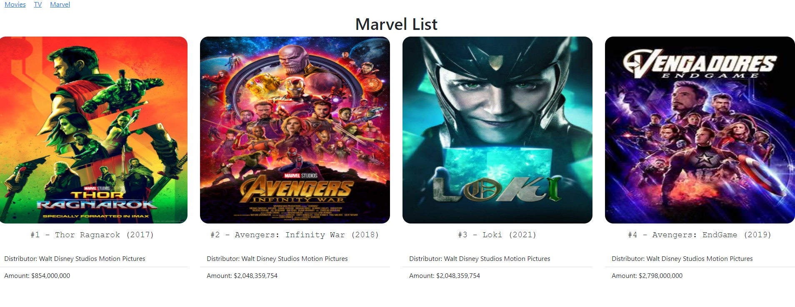
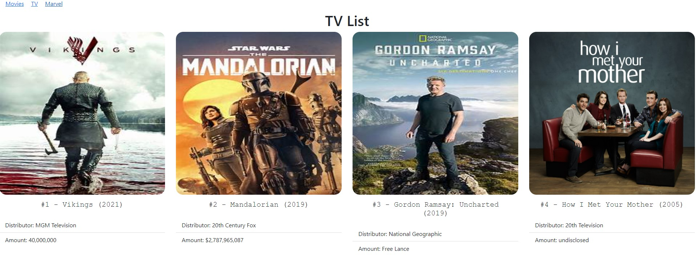

# react-movielist

- [Description:](#description)
- [Packages:](#packages)
- [Contributers:](#contributers)
- [Images](#videos)
- [My-info:](#my-info)
    
## Description:

Created this complete frontend project using webpacks and react. This project was built to help me learn how to bring in JSON data into a react project to display the given information. I used movies, TV, and marvel movies/shows to display my faviorite ones. Connecting the JSON data I brought in the name of the movie, rank I placed them in, distributer, and amount earned (box-office). There is currently no deployed site

## Packages:
1. npm install --save-dev webpack-cli
2. npm install react-dom
3. npm install react
4. npm install --save-dev @babel/core
5. npm install --save-dev @babel/preset-env
6. npm install --save-dev @babel/preset-react
7. npm install --save-dev @babel/preset-loader
8. npm install --save-dev html-webpack-plugin
9. npm install --save-dev-bootstrap
10. npm install --save-dev css-loader
11. npm install --save-dev eslint
12. npm install --save-dev eslint-loader
13. npm install --save-dev eslint-plugin-react

    
## Contributers:
Clinton Rizzo
    
## Images
- images from mobile device

## My-info:

For additional information or questions please reach out to my email: clint.rizzo92@gmail.com
